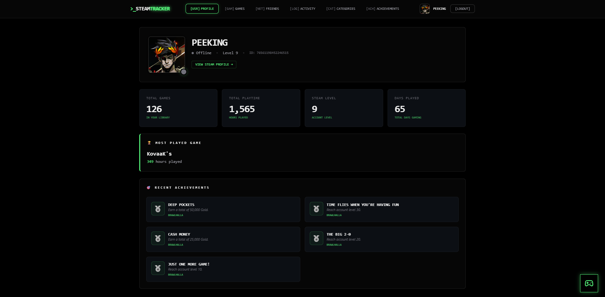
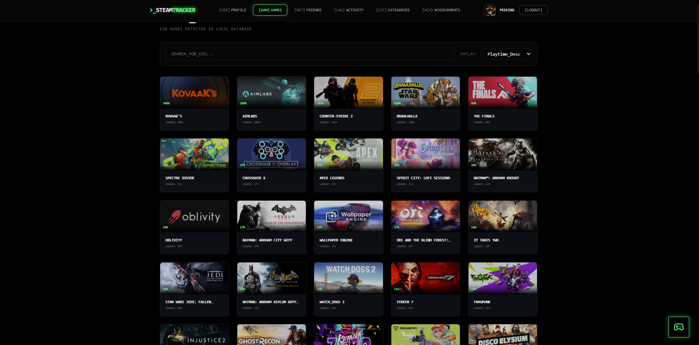
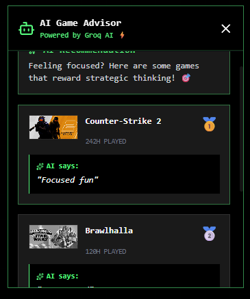
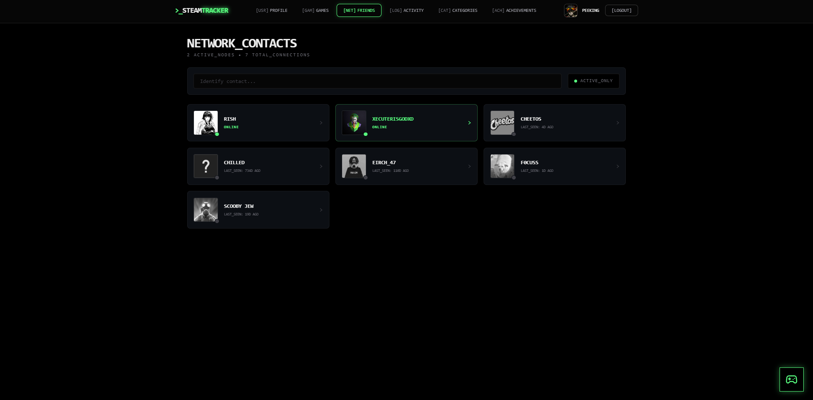

# 🎮 Steam Tracker — AI-Powered Gaming Analytics Platform

> **Track your gaming journey. Analyze stats. Get AI-powered recommendations.**

Steam Tracker is a full-stack web application that integrates with the **Steam Web API** to provide gaming analytics, social features, and **AI-powered game recommendations**. Built with **React + Express**, it includes Steam Open Auth login, friend tracking, achievements monitoring, custom game categories, and a chatbot-style recommendation system powered by **Groq AI**.

**Tech Stack:** React, Tailwind CSS, Node.js, Express, Steam Web API, Passport.js (Steam OAuth), Groq AI

---

## 🔗 Live Demo
- **Steam Tracker:** https://steam-tracker-peach.vercel.app

---

## 🎥 Demo Video
[Watch Demo Video] here (https://youtu.be/KuM2iyNbQX0) 

---

## 📸 Screenshots

---

## ✅ Key Features

### 🔐 Steam Authentication
- Login with **Steam OpenID** using Passport.js
- Secure session handling with cookies
- Protected routes with React Router

### 📊 Gaming Analytics
- Total games owned + total playtime stats
- Weekly activity breakdown & distributions
- Recent achievements monitoring
- Steam level display from Steam API

### 🤖 AI-Powered Game Recommendations
- Chatbot-style recommendation flow
- Personalized suggestions based on:
  - **day type**
  - **mood**
  - **time available**
- Uses **Groq (Llama 3.3 70B)** with fallback when AI is unavailable

### 👥 Social Features
- Friends list with online/offline status
- Friend profile viewing (for public profiles)
- Search & filter friends easily
- Handles private Steam profiles gracefully

### 🎯 Game Library Management
- Search + sort games by playtime/name/activity
- Game detail view with achievements + stats
- One-click launch via Steam protocol (steam://)

### 📁 Custom Categories + Session Logging
- Create custom collections (e.g., “Competitive FPS”, “Story Games”)
- Save gaming sessions with mood + notes
- Timeline-style session history

---

## 🧾 License
MIT License[LICENSE](LICENSE)
